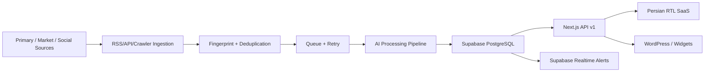

# Production Architecture

## Product Boundary

The platform is a Persian crypto macro intelligence SaaS. It collects, normalizes, translates and interprets macro, financial, crypto, on-chain, derivatives, ETF, stablecoin, sentiment and geopolitical data. It does not provide buy/sell signals, entry/exit points, leverage guidance or guaranteed predictions.

## High-Level Flow



## Core Modules

- Ingestion: source registry, RSS/API/crawler abstraction, dedupe, retry and source health.
- AI pipeline: cleaning, language detection, Persian translation, classification, impact analysis, regime mapping and alert level.
- Market regime: scores DXY, US10Y, Nasdaq, ETF flows, funding, OI, stablecoin supply, whale activity, volatility, sentiment and headline stress.
- Correlation engine: rolling 7D/30D/90D correlations, decoupling detection, breakdown detection and Persian interpretation.
- Smart alerts: Macro, Fed, ETF, Stablecoin, Whale, Correlation, Geopolitical, Derivatives, Liquidity and Exchange Risk.
- USDT risk center: TRON/ERC20, freeze risk, sanctions risk, custody, dominance, mint/burn and Iran premium.
- Admin: source management, ingestion monitor, AI logs, failed jobs, alert review, manual analysis, duplicate management, regime override and prompt testing.

## Data Contract

Every raw item has:

```json
{
  "source": "Federal Reserve",
  "title": "original title",
  "content": "raw content",
  "category": "central_banks",
  "timestamp": "2026-05-23T10:00:00Z",
  "language": "en",
  "url": "https://...",
  "fingerprintHash": "fp_..."
}
```

Processed items add Persian title, Persian summary, key points, tags, impact analysis, market regime tags and alert level.

## Deployment Shape

- Frontend/API: Vercel Next.js 15
- Database/Auth/Realtime: Supabase
- Queue/cache: Redis-backed workers or managed queue
- Python analytics: containerized FastAPI service
- Cron: Vercel Cron or external scheduler calling `/api/cron/ingest`
- AI: OpenAI API with prompt versioning and audit logs

## WordPress Compatibility

The API is headless by default. WordPress can consume:

- `/api/v1/wordpress` for compact widget payloads
- `/public/embed-widget.js` for embeddable cards
- `/api/v1/news`, `/api/v1/assets/:symbol`, `/api/v1/correlations` for custom plugin pages
