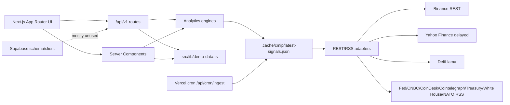

# C.M.I.P Architecture Audit

Audit date: 2026-05-25  
Scope: Phase 1 only. Runtime code was not modified.

## Executive Summary

The project is no longer a pure static demo, but it is not yet a production-grade market intelligence platform. The current system has a useful Next.js dashboard, several quantitative engine files, public REST adapters for some live/delayed data, a 30-minute filesystem signal cache, and API endpoints that expose engine outputs.

The critical architectural problem is that the app still mixes real adapter-backed signals with `src/lib/demo-data.ts` in dashboard widgets, API routes, asset pages, WordPress payloads, admin panels, and the ingestion simulation. This creates an inconsistent state: some scores are calculated from real or delayed public data, while news, asset narratives, pricing/plan UI, source health, and ingestion items can still come from hardcoded demo structures.

Production readiness is blocked by missing persistent ingestion, missing queue/workers, no database-backed source health, no websocket market feed, no Redis usage despite the env placeholder, no Supabase runtime writes, no real normalized event pipeline, and no source-level reliability engine that can disable affected modules automatically.

## Current Architecture



## Frontend Architecture

The frontend is built with Next.js App Router, TypeScript, Tailwind, and a component system under `src/components`. The main dashboard is rendered in `src/app/page.tsx` using server components from `src/components/dashboard/panels.tsx`.

Key observations:

- Dashboard panels directly call server-side engine functions such as `getMarketRegimeReport`, `getLiquidityReport`, `getDynamicCorrelationReport`, `getAssetImpactProfiles`, and `generateSmartAlerts`.
- The dashboard also imports `categoryLabels`, `getNewsGroupedByCategory`, `getNewsItems`, `pricingPlans`, and `usdtRiskCenter` from `src/lib/demo-data.ts`.
- `AppShell` calls `/api/v1/refresh` on mount and every 30 minutes, then calls `router.refresh()`. This is client-driven refresh, not a backend scheduler by itself.
- The UI has data quality badges, but module statuses in `src/lib/data-source-status.ts` are mostly static declarations, not calculated from current source health.
- Asset pages under `src/app/assets/[symbol]/page.tsx` still load base asset definitions from demo data.

Frontend conclusion: the shell and dashboard structure are usable, but the dashboard is still tightly coupled to mixed data paths. A production version should read stable API contracts or database-backed view models, not import demo fixtures directly.

## Backend Architecture

Current server-side code is organized under:

- `src/server/data`: adapter and signal cache layer.
- `src/server/analytics`: scoring, quality, confidence, liquidity, correlation, regime, sentiment, divergence, scenario, and asset impact engines.
- `src/server/alerts`: smart alert generation.
- `src/server/ingestion`: static source registry and simulated ingestion pipeline.
- `src/server/ai`: deterministic prompt/processing helpers.
- `src/server/supabase`: Supabase client factory.
- `src/server/wordpress`: WordPress payload adapter.

Strengths:

- Engines are modular enough to keep and refine.
- Data quality and confidence logic now includes minimum signal-group checks, stale-data caps, and estimated-data rejection.
- Correlations use return series and sample-size checks instead of static +1/-1 values.
- Adapter functions return structured `value`, `timestamp`, `source`, `quality`, `reliability`, and error metadata.

Major gaps:

- No persistent storage path for current market data, raw events, normalized events, alerts, correlations, regimes, or reliability snapshots.
- No real collector abstraction for RSS/API/websocket/scraper sources.
- No queue, retry scheduler, dead-letter handling, or job state persistence.
- No Redis-backed cache or locks despite `REDIS_URL` in `.env.example`.
- No websocket ingestion for Binance BTCUSDT, ETHUSDT, SOLUSDT.
- No real OpenAI processing integration despite AI prompt helper files.

## API Routes

Current API routes:

- `/api/v1/overview`
- `/api/v1/news`
- `/api/v1/assets/[symbol]`
- `/api/v1/alerts`
- `/api/v1/correlations`
- `/api/v1/market-regime`
- `/api/v1/refresh`
- `/api/v1/wordpress`
- `/api/cron/ingest`

Mapping:

| Route | Current behavior | Production concern |
|---|---|---|
| `/api/v1/overview` | Combines engines with `demo-data` assets, news, source health, pricing plans, USDT center | Mixed real/demo payload |
| `/api/v1/news` | Serves `getNewsItems`/grouped demo news | Not real ingestion-backed |
| `/api/v1/assets/[symbol]` | Uses demo asset intelligence and demo relevant news, plus current asset impact engine | Mixed asset model |
| `/api/v1/alerts` | Uses generated smart alerts from current engines | Not persisted, no dedupe state |
| `/api/v1/correlations` | Uses calculated correlation report | Limited by cache history, no DB snapshots |
| `/api/v1/market-regime` | Uses current regime engine | No historical regime persistence |
| `/api/v1/refresh` | Refreshes filesystem cache if stale | Client-triggerable, no auth, no distributed lock |
| `/api/v1/wordpress` | Builds WordPress payload from demo news | Not production headless payload |
| `/api/cron/ingest` | Refreshes signal cache, returns source registry summary | Name implies ingestion but does not store raw events |

## Cron And Realtime

`vercel.json` defines a cron schedule:

```json
{ "path": "/api/cron/ingest", "schedule": "*/30 * * * *" }
```

This refreshes the signal cache every 30 minutes on Vercel if deployment and `CRON_SECRET` behavior are configured correctly. Locally, the 30-minute refresh depends on the browser's `AppShell` interval calling `/api/v1/refresh`.

There is no server-side local scheduler, no background worker process, no websocket collector, and no event-based alert engine. The "Realtime Monitoring" UI is therefore aspirational for most modules.

## Supabase And Database Design

There is an initial migration in `supabase/migrations/202605230001_initial_crypto_macro_schema.sql`. It creates many product-era tables such as `raw_items`, `processed_items`, `impact_analyses`, `asset_impacts`, `alerts`, `market_regimes`, `liquidity_snapshots`, `stablecoin_snapshots`, `etf_flow_snapshots`, `onchain_snapshots`, `derivatives_snapshots`, `sentiment_snapshots`, `correlation_snapshots`, `watchlists`, and `ai_logs`.

Current gaps relative to the requested production architecture:

- Required tables missing or mismatched: `source_health`, `raw_events`, `normalized_events`, `event_clusters`, `raw_metrics`, `market_prices`, `market_snapshots`, `correlations`, `liquidity_scores`, `regime_snapshots`, `smart_alerts`, `translation_outputs`, `user_alert_preferences`, `processing_jobs`, `processing_errors`, `intelligence_reliability`, `coverage_snapshots`.
- Existing `sources` lacks full polling/retry/rate-limit/parser/degraded-mode configuration.
- Existing `ingestion_jobs` is not used by runtime code.
- Supabase client exists but no inspected route or engine currently writes to Supabase.
- RLS exists for many tables, but service-role usage is not isolated by repository modules yet.

Database conclusion: the schema is a good first product sketch but not the requested production event/metrics intelligence store. A second migration path is needed rather than patching engine output into the old shape.

## State Management

State is split across:

- server component function calls,
- static module status config,
- `src/lib/demo-data.ts`,
- filesystem cache at `.cache/cmip/latest-signals.json`,
- in-memory memoization inside `market-signals.ts`,
- client-side refresh interval in `AppShell`.

This is not safe for production multi-instance deployment. Vercel serverless instances may not share filesystem cache consistently. Redis or Supabase-backed snapshot storage is needed, with cache invalidation, distributed locks, and source freshness metadata.

## Mock/Demo Data Exposure

The following runtime files still import `src/lib/demo-data.ts`:

- `src/components/assets/asset-dashboard.tsx`
- `src/components/dashboard/panels.tsx`
- `src/components/admin/admin-console.tsx`
- `src/app/assets/[symbol]/page.tsx`
- `src/app/sentiment/page.tsx`
- `src/server/wordpress/adapter.ts`
- `src/server/ingestion/pipeline.ts`
- `src/app/api/v1/assets/[symbol]/route.ts`
- `src/app/api/v1/overview/route.ts`
- `src/app/api/v1/news/route.ts`

This is the largest source of hidden demo behavior.

## Analytics Engine Audit

Current engines are materially better than a generic narrative dashboard, but they remain bounded by shallow inputs:

- Correlation engine calculates Pearson correlations on return series and enforces minimum samples. This is a valid direction, but history is sourced from cache payloads rather than a durable price table.
- Liquidity engine separates macro, crypto, spot, leveraged liquidity, and sustainability. Some required inputs are env-configured or unavailable, so output can become partial.
- Market regime engine applies penalties and multi-layer confirmation. It still has fixed previous regime values and no persisted regime transitions.
- Sentiment engine is not true news intelligence. It scores two aggregate RSS-derived signals, not individual Reuters/Bloomberg/Fed/SEC items with entity extraction and priced-in analysis.
- Smart alerts are generated at request time from current engine state. They are not persisted, reviewed, deduplicated across time, or linked to causal event clusters.
- AI layer is deterministic scaffolding. No real OpenAI translation/summarization/event interpretation pipeline is active.

## Security Audit

Current gaps:

- `/api/v1/refresh` has no auth/rate limiting and can trigger external adapter calls when cache is stale.
- `/api/cron/ingest` checks `CRON_SECRET` only if the env var is set. If unset, it is open.
- No global API rate limiting.
- No request validation middleware beyond simple route logic.
- No queue isolation or secret scope separation.
- Supabase service role fallback is in `createSupabaseServerClient`; repository boundaries should ensure it is never exposed to client code.

## Performance And Scalability

Risks:

- Engine functions recompute during server render and route handling.
- Several panels call the same engines independently, producing repeated computation.
- Filesystem cache is not suitable for multi-region/serverless consistency.
- External adapter calls are concurrent but lack retries, backoff, rate-limit budgets, and provider-specific throttling.
- No materialized snapshots for correlations/regimes/alerts.
- No streaming or websocket ingestion for price updates.

## Audit Conclusion

C.M.I.P currently has a promising analytics prototype with partial real data adapters, but the production architecture requested by the user does not exist yet. The next safe step is not cosmetic UI work. It is to remove demo dependencies from runtime paths, introduce a persistent ingestion and metrics store, implement source health/reliability scoring, then make the dashboard consume only validated intelligence snapshots.

