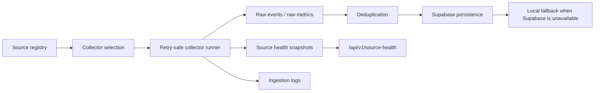

# Phase 2 Architecture Changes

Date: 2026-05-25
Project: C.M.I.P, Crypto Macro Intelligence Platform

## New Modular Structure

The following production-oriented directories were introduced under `src/`:

- `src/collectors`
- `src/processors`
- `src/engines`
- `src/storage`
- `src/queues`
- `src/health`
- `src/api`
- `src/types`

## Ingestion Flow

## Key Files Added

- `src/types/ingestion.ts`: canonical ingestion contracts.
- `src/collectors/registry.ts`: configurable source registry.
- `src/collectors/registry.ts`: source summary and asset source mapping helpers, replacing the old duplicate ingestion registry.
- `src/collectors/rss/rss-collector.ts`: RSS ingestion collector.
- `src/collectors/api/market-signal-collector.ts`: API collector using existing real public adapters.
- `src/processors/deduplication.ts`: stable hash deduplication.
- `src/queues/ingestion-queue.ts`: retry-safe collector execution.
- `src/storage/ingestion-store.ts`: Supabase-first persistence and local fallback.
- `src/health/source-health.ts`: source health and foundation status.
- `src/api/ingestion.ts`: ingestion orchestration.
- `src/app/api/v1/source-health/route.ts`: source health API.
- `supabase/migrations/202605250001_ingestion_foundation.sql`: ingestion storage schema.

## API Route Changes

- `src/app/api/cron/ingest/route.ts` now runs the production ingestion foundation.
- `src/app/api/v1/refresh/route.ts` now refreshes market signal cache and ingestion foundation together.
- `src/app/api/v1/news/route.ts` now serves raw ingestion events instead of demo news.
- `src/app/api/v1/overview/route.ts` now exposes ingestion foundation status.

## Data Storage Model

Phase 2 added tables for:

- `source_health`
- `raw_events`
- `raw_metrics`
- `ingestion_logs`

These tables support source metadata, timestamps, quality labels, retry/error context, deduplication hashes, and freshness tracking.

## Degraded Mode

If Supabase is unavailable or a table is missing, ingestion writes JSONL records to:

`CMIP_INGESTION_STORE_PATH`, defaulting to `.cache/cmip/ingestion`.

This keeps local development and collector debugging usable without silently fabricating intelligence.

## Remaining Architecture Gaps

- Redis-backed queue implementation is not yet present.
- Supabase read models for latest events and metrics are not yet implemented; local sync reads are available for fallback/runtime display.
- Websocket ingestion is not yet implemented.
- AI normalization and semantic event clustering are not yet implemented.
- Legacy analytics engines still exist but must be rebuilt or retired in later phases.
