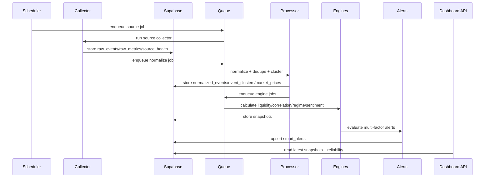
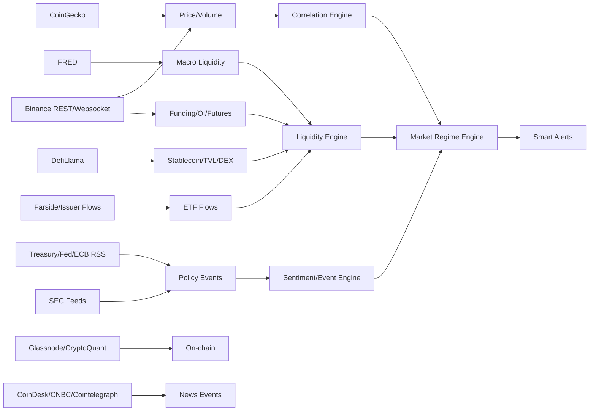

# C.M.I.P Backend Redesign Proposal

Audit date: 2026-05-25  
Goal: target architecture for a production-grade Crypto Macro Intelligence Platform.

## Target Folder Structure

```text
src/
  collectors/
    rss/
    api/
    websocket/
    scraper/
  processors/
    normalization/
    deduplication/
    clustering/
  engines/
    reliability/
    confidence/
    scoring/
  alerts/
  ai/
  correlations/
  liquidity/
  regimes/
  storage/
    repositories/
    supabase/
    redis/
  queues/
  api/
    dashboard/
    events/
    alerts/
    health/
  types/
  utils/
  monitoring/
  health/
  config/
```

Existing files under `src/server/analytics` can be migrated into `src/engines`, `src/liquidity`, `src/regimes`, `src/correlations`, and `src/alerts` after storage contracts exist.

## Production Data Flow



## Core Database Model

### Source Tables

`sources`

- `id`
- `name`
- `source_type`
- `tier`
- `endpoint`
- `enabled`
- `polling_interval_seconds`
- `timeout_ms`
- `retry_policy`
- `rate_limit_per_minute`
- `parser_rules`
- `priority_score`
- `required_env_keys`
- `degraded_mode`
- `metadata`
- timestamps

`source_health`

- `id`
- `source_id`
- `status`
- `last_success_at`
- `last_failure_at`
- `latency_ms`
- `freshness_minutes`
- `error_rate_24h`
- `last_error`
- `consecutive_failures`
- `next_retry_at`
- timestamps

### Raw And Normalized Data

`raw_events`

- source metadata
- raw payload
- URL/hash
- timestamp
- language
- dedup hash
- ingestion job ID
- retry/status metadata

`normalized_events`

- event type
- title/source/timestamp
- affected assets
- transmission channel
- severity
- novelty
- source reliability
- structured entities
- confidence metadata

`event_clusters`

- canonical event ID
- duplicate raw event IDs
- entities
- cluster hash
- first/last seen
- source overlap

`raw_metrics`

- source ID
- asset
- metric
- value
- previous value
- timestamp
- quality
- sample size
- payload hash

`market_prices`

- asset/symbol
- venue/source
- price
- volume
- interval
- timestamp
- quality

`market_snapshots`

- grouped latest values by asset and timestamp.

### Intelligence Snapshots

`correlations`

- pair
- interval
- value
- previous value
- sample size
- state
- interpretation
- data quality

`liquidity_scores`

- macro liquidity
- crypto liquidity
- real spot liquidity
- leveraged liquidity
- sustainability
- state
- input references

`regime_snapshots`

- regime
- previous regime
- nuance
- score
- confidence
- transition probability
- key drivers
- affected assets
- invalidation signals

`smart_alerts`

- causal key
- title
- type
- severity
- affected assets
- evidence
- confidence
- invalidation
- status
- dedupe metadata

`intelligence_reliability`

- overall reliability
- critical sources online/total
- module coverage scores
- degraded modules
- created_at

`coverage_snapshots`

- macro coverage
- crypto coverage
- liquidity coverage
- derivatives coverage
- sentiment coverage
- geopolitical coverage
- missing critical sources

## Source Dependency Map



## Collector Interfaces

```ts
export type SourceStatus =
  | "success"
  | "degraded"
  | "failed"
  | "api_key_missing"
  | "disabled";

export type CollectorOutput = {
  sourceId: string;
  status: SourceStatus;
  fetchedAt: string;
  latencyMs: number;
  rawEvents: RawEventInput[];
  rawMetrics: RawMetricInput[];
  error?: string;
};

export interface Collector {
  sourceType: "rss" | "api" | "websocket" | "scraper" | "social" | "filings";
  collect(source: SourceConfig): Promise<CollectorOutput>;
}
```

## Reliability Model

Reliability should be calculated continuously:

```ts
intelligenceReliability =
  0.25 * criticalSourceAvailability +
  0.20 * dataFreshness +
  0.20 * sourceReliabilityWeighted +
  0.15 * signalCoverage +
  0.10 * crossSourceConfirmation +
  0.10 * processingHealth
```

Module coverage:

- Macro: DXY, US10Y, Fed/Treasury/FRED/calendar.
- Crypto: BTC/ETH/SOL price/volume.
- Liquidity: stablecoins, ETF, reserves, macro liquidity.
- Derivatives: funding, OI, liquidations.
- Sentiment: news events, policy events, social if available.
- Geopolitical: Treasury/White House/NATO/OPEC/security feeds.

Rules:

- Critical source missing lowers confidence and disables affected conclusions.
- Stale source marks signals stale and caps confidence.
- Missing API key marks source `api_key_missing`, not failed.
- Low coverage reduces alert priority/aggressiveness.

## Degraded Mode

When data is unavailable:

```json
{
  "module": "ETF flow analysis",
  "status": "unavailable",
  "reason": "Farside/issuer feed not configured",
  "score": null,
  "confidence": null,
  "message": "ETF flow analysis disabled because no valid source is available."
}
```

When data is partial:

```json
{
  "module": "Liquidity Engine",
  "status": "partial",
  "score": -18,
  "confidence": 52,
  "missingInputs": ["BTC ETF flow", "exchange reserves"],
  "degradedModules": ["institutional flow", "on-chain reserve analysis"]
}
```

## Dashboard API Contracts

`/api/dashboard/overview`

- latest regime snapshot
- liquidity snapshot
- asset impact summaries
- top alerts
- data reliability summary
- degraded modules

`/api/events/latest`

- latest normalized events and clusters
- Persian summaries
- source quality

`/api/assets/:symbol/intelligence`

- one-week asset impact map
- scenarios
- drivers/opposing drivers
- confidence status
- source mapping

`/api/source-health`

- source list
- status
- freshness
- last error
- retry state

`/api/reliability`

- coverage scores
- critical source count
- reliability score
- degraded modules

## Deployment Guide

Production dependencies:

- Vercel for Next.js API/UI.
- Supabase PostgreSQL for durable events, metrics, snapshots, user data.
- Redis for hot cache, queue, distributed locks, and rate-limit counters.
- Worker runtime for websocket and queue processing. If Vercel is used for UI, long-running websocket collectors should run in a separate worker host.

Required deployment steps:

1. Apply Supabase v2 migrations.
2. Seed sources.
3. Configure env and validate with `src/config/env.ts`.
4. Start worker process.
5. Enable Vercel cron routes only after `CRON_SECRET` is set.
6. Verify source health and reliability API.
7. Enable dashboard APIs.

## Production Readiness Checklist

- [ ] No production route imports `src/lib/demo-data.ts`.
- [ ] `CMIP_ALLOW_DEV_FALLBACK=false` in production.
- [ ] Missing API keys mark sources `api_key_missing`.
- [ ] Raw events and metrics persist to Supabase.
- [ ] Redis queue and dead-letter handling are active.
- [ ] Binance websocket collector runs outside request lifecycle.
- [ ] Correlations use persisted price series with sample-size validation.
- [ ] Alerts persist with dedupe causal keys.
- [ ] Reliability score is shown on dashboard.
- [ ] Public APIs are rate-limited.
- [ ] Cron routes require `CRON_SECRET`.
- [ ] Persian AI outputs are stored with prompt version and source references.

## Scaling Recommendations

- Keep frontend/API reads snapshot-oriented.
- Run collectors/workers separately from Vercel serverless request paths.
- Partition high-frequency price tables by date or use TimescaleDB if volume grows.
- Store raw HTML/RSS payloads compressed or in object storage if they become large.
- Use materialized latest views for dashboard endpoints.
- Cache public dashboard responses for short windows, but never hide stale source warnings.

## Cost Optimization

- Start with free sources: Binance, CoinGecko, DefiLlama, RSS, SEC.
- Use paid sources only for modules that produce user-visible value: ETF, derivatives, on-chain reserves.
- Run AI only after deduplication and clustering.
- Cache AI summaries by event cluster hash.
- Avoid recomputing correlations on every render; schedule and persist them.

