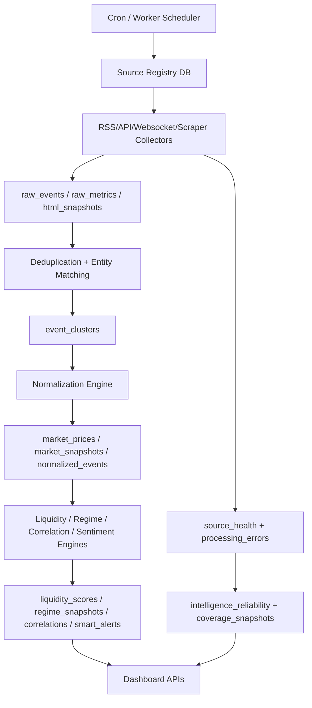

# C.M.I.P Ingestion Gap Analysis

Audit date: 2026-05-25  
Scope: Current ingestion/data collection vs requested production ingestion platform.

## Current Ingestion Reality

There are two separate mechanisms:

1. `src/server/data/adapters.ts` fetches current signal points from selected public REST/RSS sources.
2. `src/server/ingestion/pipeline.ts` simulates news ingestion from `src/lib/demo-data.ts`.

The first mechanism is a useful signal adapter layer. The second is not real ingestion.

## Requested Target

The requested platform needs:

- RSS collectors every 10 minutes.
- API collectors with rate limiting, backoff, retries, normalized output.
- Binance websocket collectors for BTCUSDT, ETHUSDT, SOLUSDT.
- Scraper layer only where API/RSS does not exist.
- Raw payload storage.
- Deduplication and semantic clustering.
- Processing queues.
- Source health and reliability snapshots.
- Degraded mode when sources fail or API keys are missing.

## Current vs Target Matrix

| Capability | Current implementation | Gap |
|---|---|---|
| RSS polling | RSS title baskets inside `fetchNewsScore` | No raw item storage, no per-source health, no item timestamps validation beyond feed fetch |
| API polling | Direct REST calls in adapters | No source config, retry policy, rate budgets, persistence, or job history |
| Websocket ingestion | None | Binance websocket collectors missing |
| Scraper layer | None | Farside ETF/selected SEC pages missing |
| Raw payload storage | None | Need `raw_events`, `raw_metrics`, payload JSON, HTML snapshots |
| Normalization | Signal-level normalization only | Need normalized event schemas for policy, macro, ETF, stablecoin, whale, etc. |
| Deduplication | In-memory fingerprint inside simulated pipeline | Need URL/title/entity/timing/semantic clustering |
| Queue | None | Need Redis/BullMQ or Supabase-backed jobs |
| Retry/backoff | Basic timeout only | Need exponential backoff, retry counts, dead-letter |
| Source health | Static registry, cache failedSources list | Need persisted health status, latency, error rate, freshness |
| Reliability scoring | Quality engine exists for signals | Need source/module/coverage reliability snapshots |
| Alert triggers | Generated on request | Need event-based alert worker and persisted causal keys |

## Source-Specific Gaps

### Free Sources That Should Work Immediately

| Source | Current status | Required work |
|---|---|---|
| Binance REST | Partially implemented | Add websocket collector and durable price/volume storage |
| Binance websocket | Missing | Implement stream workers for ticker/trades/klines |
| CoinGecko public API | Missing | Add price/market data fallback and asset metadata |
| DefiLlama stablecoins | Partially implemented | Add chain distribution, TVL, DEX volume, stablecoin flows |
| Fed RSS | Partially used in title basket | Store individual raw/normalized events |
| ECB RSS | Missing | Add source config and RSS collector |
| Treasury RSS | Partially used in geopolitics basket | Store events and classify policy/sanctions |
| SEC public feeds | Missing | Add filings collector |
| CoinDesk/Cointelegraph RSS | Partially used in title basket | Store real news events |
| CNBC RSS | Partially used | Store real news events |

### Paid/Premium Sources

| Source | Current status | Required behavior without key |
|---|---|---|
| Trading Economics | Missing adapter | `api_key_missing`, no fabricated macro calendar |
| FRED | Missing adapter | `api_key_missing` unless public endpoint configured |
| Whale Alert | Missing env and adapter | Module unavailable |
| CoinGlass | No paid adapter; limited Binance futures substitute | Paid metrics unavailable, Binance-derived leverage still separate |
| Glassnode/CryptoQuant/Santiment/CoinMetrics | Missing adapters | On-chain modules degraded |
| Reuters/Bloomberg/FT/WSJ | Registry unavailable only | Premium news unavailable |

## Ingestion Flow Needed



## Recommended Collector Contract

Each collector should return:

```ts
type CollectorResult = {
  sourceId: string;
  status: "success" | "degraded" | "failed" | "api_key_missing";
  fetchedAt: string;
  latencyMs: number;
  rawPayloadHash: string;
  events: RawEvent[];
  metrics: RawMetric[];
  errors: ProcessingError[];
};
```

Each source config should include:

- `source_type`
- `polling_interval_seconds`
- `retry_policy`
- `timeout_ms`
- `parser_rules`
- `priority_score`
- `enabled`
- `rate_limit_per_minute`
- `degraded_mode`
- `required_env_keys`

## Update Frequency Gap

| Requested job | Current behavior | Gap |
|---|---|---|
| RSS every 10 minutes | No true RSS polling job | Add scheduled RSS collector |
| Websocket real-time | None | Add long-running worker or hosted websocket ingestion |
| Regime every 5 minutes | Regime computed on request from cache | Persist scheduled regime snapshots |
| Correlations every 15 minutes | Computed on request | Persist correlation snapshots |
| Liquidity every 30 minutes | Computed on request/cache | Persist liquidity score snapshots |
| Alert engine event-based | Generated on request | Trigger from normalized events/metric deltas |

## Immediate Blocking Issues

1. Replace simulated ingestion pipeline with real collector interfaces.
2. Create source health persistence before adding many sources.
3. Add raw metric/event tables before writing processors.
4. Add Redis/queue or Supabase job table implementation.
5. Make all dashboard APIs read from produced snapshots, not direct demo fixtures.

