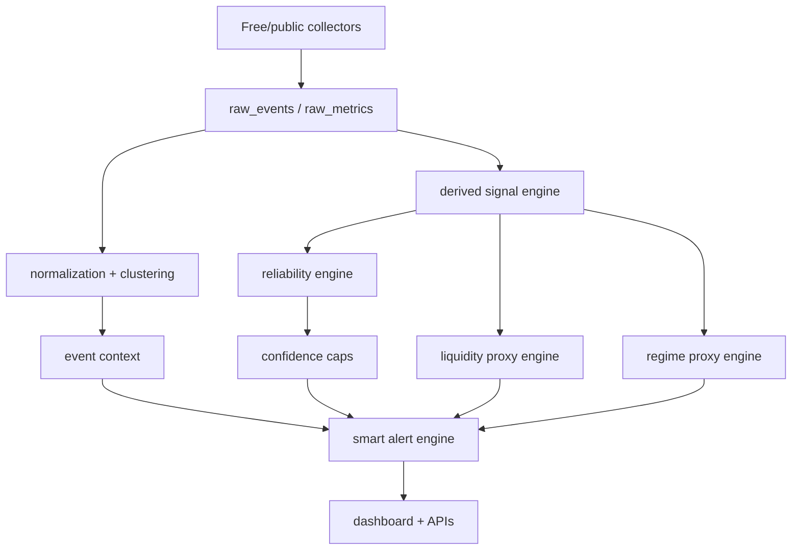

# New Intelligence Flow

```mermaid
flowchart TD
  A["Free/public collectors"] --> B["raw_events / raw_metrics"]
  B --> C["normalization + clustering"]
  B --> D["derived signal engine"]
  C --> E["event context"]
  D --> F["reliability engine"]
  D --> G["liquidity proxy engine"]
  D --> H["regime proxy engine"]
  F --> I["confidence caps"]
  G --> J["smart alert engine"]
  H --> J
  E --> J
  I --> J
  J --> K["dashboard + APIs"]
```

## اصل طراحی

Narrative فقط بعد از داده و scoring ساخته می‌شود. اگر داده‌ای وجود ندارد، سیستم به‌جای نوشتن تحلیل ساختگی، missing input را نمایش می‌دهد.

